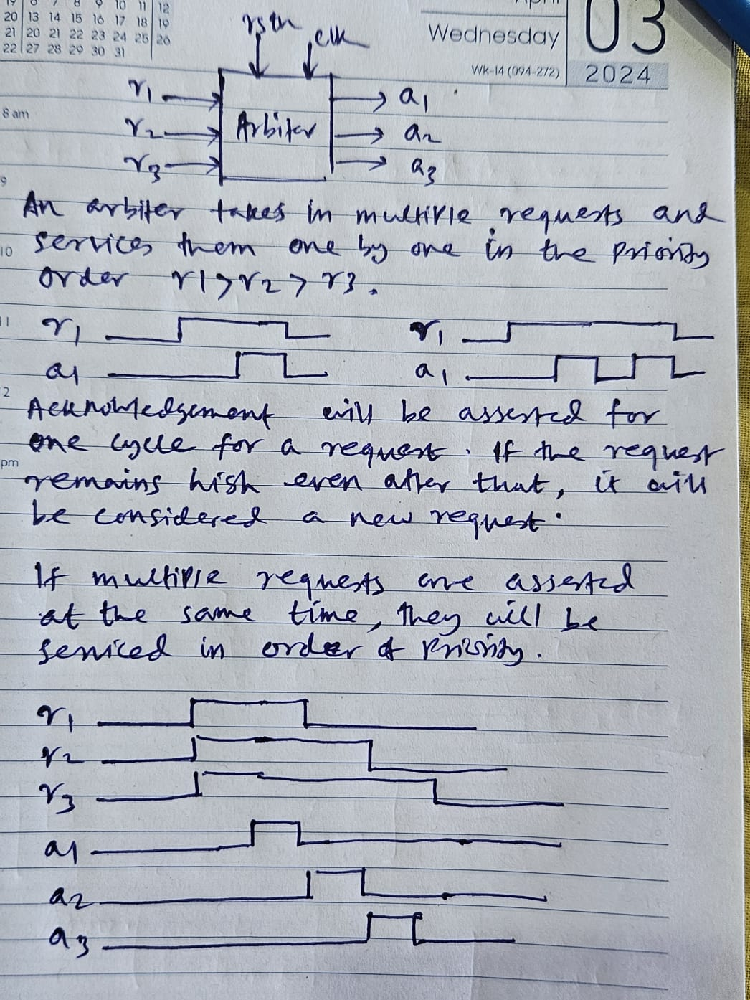
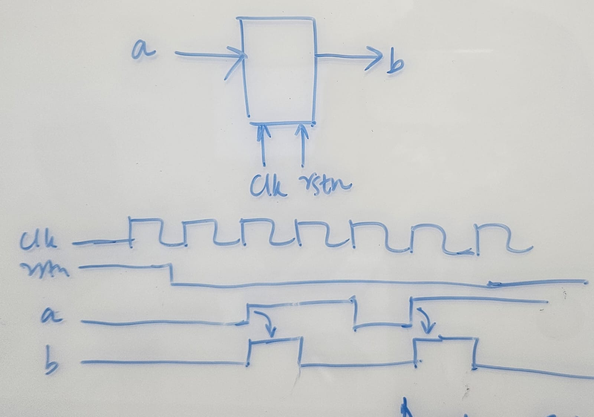
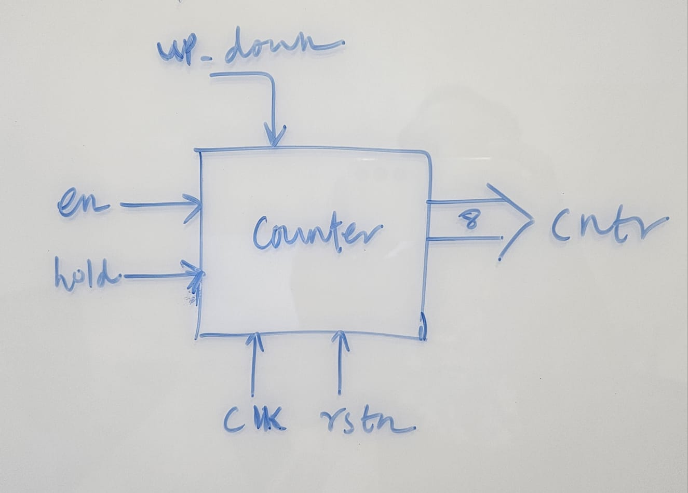
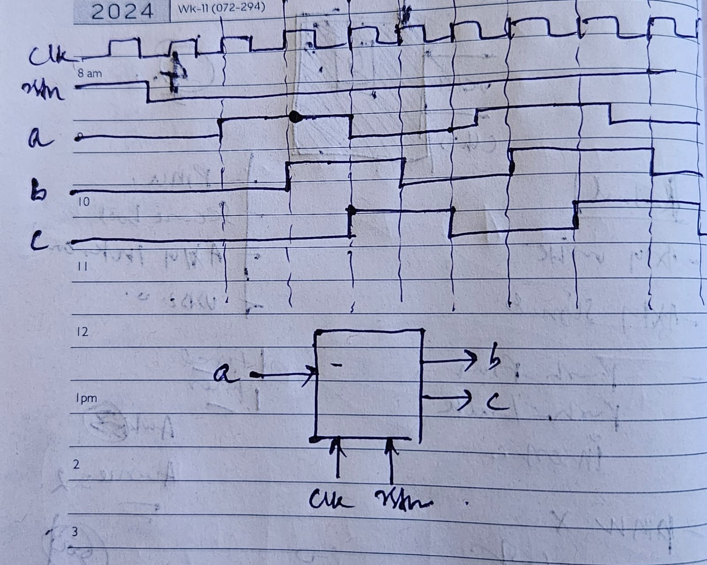

# About
VLSI Mentoring Portal for the 2026 Silicon University Batch.

# Resources

- **LITERATURE**
  - Clifford Cummings, _State Machine Coding Styles for Synthesis_, SNUG, 1998 ([PDF](media/CummingsSNUG1998SJ_FSM.pdf))
  - Clifford Cummings, _Nonblocking Assignments in Verilog Synthesis, Coding Styles That Kill!_, SNUG, 2000 ([PDF](media/CummingsSNUG2000SJ_NBA.pdf))
  - Clifford Cummings, et.al., _Asynchronous & Synchronous Reset Design Techniques - Part Deux_, SNUG, 2003 ([PDF](media/CummingsSNUG2003Boston_Resets.pdf))
  - [Clifford Cummings Google Scholar](https://scholar.google.com/citations?user=j53P4MQAAAAJ&hl=en&oi=ao) A great resource of papers on practical digital design.
- **ONLINE**
  - [Verilog Tutorials from ChipVerify](https://www.chipverify.com/tutorials/verilog): for begineers that take you from basic datatypes to building hardware circuits.

# Sessions

**Sessions by Mr. Sujit Panda**
- **20 Mar 2025**
  -   Figure-1 Arbiter design problem.
    - Design an arbiter that takes in multiple requests and services them one by one in the priority order $r1 > r2 > r3$
    - Acknowledgement will be asserted for one cycle for a request. If the request remains high even after that, it will be considered a new request. If multiple requests are asserted at the same time, they will be services in order of priority.
    - Design a modification to the above problem for _Round-Robin_ priority. At reset you start with the priority $r1 > r2 > r3$, if you service say $r1$ then move it to the end ie. $r2 > r3 > r1$ and so on. 

- **27 Feb 2025**
  -   Figure-1 Positive-edge detector.
  -   Figure-2 Counter.
  - The first one is a positive edge detector and the second one is a counter.
  - For the first one, the reset (`rstn`) is _async_, active low (the reset that i have drawn is wrong. It should be inverse of what is drawn). The input signal `a` is synchronous to the `clk`. Whenever `a` goes _high_, the output signal `b` should go _high_ for 1 clock cycle. When reset is _asserted_, output `b` remains at 0.
  - For the second one, reset (`rstn`) is _async_ active low.  The counter (`cntr`) remains at `0`  while under reset. When out of reset, it counts only if `en` signal is _high_, else it remains at 0. The counter _upcounts_ if the signal up_down is high, else it downcounts. If the `hold` signal is _high_, the counter pauses at whatever count it is. It continues counting when `hold` is _low_.

- **15 Feb 2025**
  -   Figure-1 Combinarotiral problem.
  -   Figure-2 Sequential problem.
  - Write one verilog module for each of these. Write a testbench for each. Drive some stimulus to check that it works as expected.
  - For the second one, the provided waveform is representative....to describe it, `b` and `c` are _delayed_ versions of `a`. Signal `b` is delayed by one cycle and `c` is delayed by 2 cycles with respect to `a`. The circuit works on the _positive edge_ of the clock. Outputs go to `0` when `rstn=0`. The reset (`rstn`) is an asynchronous, `active low` one. **NOTE** The reset is inverted mistakenly!
    
- **14 Feb 2025**
  - Please go through these concepts in Verilog. Whatever modules code, we will need these to design and test them ([Tutorials from ChipVerify](https://www.chipverify.com/tutorials/verilog) are a good resource):
    - Ports (`input/output/inout`)
    - Variables (`reg`, `wire`)
    - `always` blocks:
      - combinatorial, sequential
      - blcoking, non-blocking
    - `assign` statements
    - `initial` block
    - `timescale` and _delays_
    - `$display`, `$finish`
    - Testbench:
      - instatiation of design
      - clock generation
      - driving stimulus
      - sampling outputs and checking
